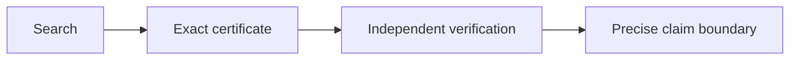

# OpenMath: Our Contributions

> **11 verified challenge submissions, 5 Lean modules, and 2 kernel-checked research certificates.**

## At a glance

| Scope | Result |
|---|---:|
| Public hills archived | **45** |
| Verified submissions | **11** |
| Lean modules | **5** |
| Kernel-checked research certificates | **2** |



## Main mathematical results

| Problem | Mathematical result | Our contribution | Status |
|---|---|---|---|
| Foundations | \(1+1=2\) | Built equality, Peano numbers, and addition from first principles | Lean checked |
| Kobon triangles | \(93\le K(18)\le94\) | Exact verification of a 93-face construction | Known lower bound verified |
| Ramsey multiplicity | \(c_4\le0.0301421885772\) | Weighted optimization below the frozen McKay reference | Candidate improvement |
| Matrix multiplication | \(\operatorname{rank}=23\), support \(=139\) | Scanned 17,372 schemes and kernel-checked 729 identities | Database minimum |
| Collatz descent | 503 rules covering all 3,352 coverable classes | Exact enumeration, optimization, and kernel verification | Coverage maximal |

---

## 1. Mathematics from first principles

We imported nothing, including Lean's standard prelude.

### Definitions

\[
0 := \operatorname{Peano.zero}
\qquad
1 := \operatorname{next}(0)
\qquad
2 := \operatorname{next}(1)
\]

### Addition axioms

\[
a+0=a
\]

\[
a+\operatorname{next}(b)=\operatorname{next}(a+b)
\]

### Certified theorem

\[
\boxed{1+1=2}
\]

```lean
theorem one_plus_one_is_two : Same (plus one one) two :=
  same_trans
    (plus_next one Peano.zero)
    (next_respects_same (plus_zero one))
```

We then proved the same theorem with Lean's standard library:

```lean
theorem one_plus_one_is_two : 1 + 1 = 2 := by
  rfl
```

**Contribution:** a side-by-side demonstration of axiomatic construction and standard-library proof.

---

## 2. Kobon triangles

### Result

\[
\boxed{18\text{ lines}\longmapsto93\text{ bounded triangular faces}}
\]

The current bounds are:

\[
\boxed{93\le K(18)\le94}
\]

Lean computes exact rational line intersections and recounts every bounded face.

| Quantity | Value |
|---|---:|
| Lines | **18** |
| Certified triangles | **93** |
| Known upper bound | **94** |

**Contribution:** an independently checkable Lean certificate for the known 93-face construction.

**Boundary:** no new record and no proof that 93 is optimal.

---

## 3. Ramsey multiplicity

For red-blue colourings of complete graphs, \(c_4\) is the asymptotic minimum density of monochromatic copies of \(K_4\).

### Exact comparison

\[
\text{candidate}
=
\frac{671117410537831388186309}
{22265052480462127079424004}
\approx 0.0301421885772
\]

\[
\text{McKay reference}
=
\frac{20480989}{679477248}
\approx 0.0301422734319
\]

Therefore:

\[
\boxed{c_4\le0.0301421885772}
\]

\[
\Delta\approx8.49\times10^{-8}
\qquad
\text{relative improvement}\approx0.000282\%
\]

```text
candidate        0.0301421885772  ├──────────────
reference        0.0301422734319  ├──────────────
                                   gap = 8.49e-8
```

### What we did

1. Started from the published 768-vertex Cayley construction.
2. Ran exact-tracked tabu edge-flip search.
3. Optimized 768 block weights.
4. Recomputed the final density with exact integers.
5. Cross-checked the fast counter against a brute-force oracle on 400 random cases.

**Contribution:** a weighted blow-up certificate that beats the hill's frozen McKay reference.

**Boundary:** candidate improvement only. Novelty and independent mathematical review remain open.

---

## 4. Matrix multiplication

For general \(3\times3\) matrices:

\[
27\text{ schoolbook multiplications}
\quad\longrightarrow\quad
\boxed{23\text{ scalar multiplications}}
\]

The rank-23 decomposition has the form

\[
AB=
\sum_{t=1}^{23}
\left(\sum_iU_{t,i}A_i\right)
\left(\sum_jV_{t,j}B_j\right)W_t,
\qquad
U,V,W\in\{-1,0,1\}^{23\times9}.
\]

### Lean certificate

\[
9^3=\boxed{729\text{ Brent identities}}
\]

| Certified property | Value |
|---|---:|
| Rank | **23** |
| Brent identities | **729 / 729** |
| Support | **139** |
| Nonzeros in \(U\) | 45 |
| Nonzeros in \(V\) | 45 |
| Nonzeros in \(W\) | 49 |

### Sparsity comparison

```text
Selected HKS       139  ███████████████████████
Laderman           153  █████████████████████████
56-addition scheme 175  █████████████████████████████
```

We measured all **17,372** mutually inequivalent rank-23 schemes in the published Heule-Kauers-Seidl database. Exactly two attain support 139.

```lean
theorem brent_all : brentHolds = true := by decide +kernel
theorem well_formed : wellFormed = true := by decide +kernel
theorem rank_is_23 : rank = 23 := by decide +kernel
theorem support_is_139 : support = 139 := by decide +kernel
```

**Contribution:** the database-wide minimum under AutoLab's support metric, converted into an exact Lean kernel-checked certificate.

**Boundary:** rank 23 is best known, not proved optimal. Support 139 is the database minimum, not a proved global minimum.

---

## 5. Collatz modular descent

Each rule proves descent on an odd residue class:

\[
n\equiv r\pmod{2^k}
\quad\Longrightarrow\quad
T^m(n)<n.
\]

### Exact result

| Quantity | Value |
|---|---:|
| Candidate rules enumerated | **10,641** |
| Residue classes checked | **3,968** |
| Coverable classes | **3,352** |
| Selected descent rules | **503** |
| Guaranteed margin threshold | \(55/64\) |

\[
\boxed{503\text{ rules cover every coverable class}}
\]

Lean checks every submitted rule for:

\[
\text{2-adic valuation}
\qquad
3^m<2^s
\qquad
T^m(r)<r.
\]

All rule-validity theorems close with `decide +kernel` and depend on no axioms.

**Contribution:** provably maximal coverage, exact rule-count optimization at the chosen margin, and kernel verification of all 503 rules.

**Boundary:** this does not prove the Collatz conjecture.

---

## 6. Seven additional verified results

| Challenge | Verified metric | Contribution | Boundary |
|---|---:|---|---|
| Busy Beaver 6 | **238,238 steps** | Valid transition certificate | Best found, not optimal |
| Grothendieck witness | \(1393/985\approx\sqrt2\) | Reached the \(2\times2\) cap | No new global bound |
| Circle packing | \(\sum r=2.6359830849175787\) | Tied the best known value in practice | 1.4e-12 below reference |
| Heilbronn triangle | minimum area **0.03652988988003022** | High-precision reproduction | Not a new configuration |
| Shakespeare | **2.0394 bits/character** | Improved the supplied baseline | Synthetic split |
| Diffusion parabola | Chamfer **0.02561** | 2.27x better than baseline | Direct estimator, not diffusion |
| Kernel optimization | median **about 66-71 GFLOP/s** | Passing optimized GPU kernel | Timing is noisy |

### Compact score view

```text
Busy Beaver       238,238 steps
Grothendieck      1393 / 985 ≈ √2
Circle packing    Σr = 2.6359830849175787
Heilbronn         A_min = 0.03652988988003022
Shakespeare       2.0394 bits / character
Diffusion         Chamfer = 0.02561
Kernel            median ≈ 66–71 GFLOP/s
```

Every displayed score comes from the hill's own evaluator.

---

## What is genuinely strongest

| Category | Strongest result |
|---|---|
| Candidate mathematical novelty | Ramsey density below the frozen reference |
| Strongest formal verification | Rank-23 matrix multiplication certificate |
| Largest axiom-free Lean certificate | 503 Collatz descent rules |
| Cleanest geometric certificate | 93 Kobon triangles |
| Broadest empirical analysis | All 17,372 HKS matrix schemes measured |

## The contribution pattern

\[
\boxed{
\text{search}
+
\text{exact arithmetic}
+
\text{formal certificate}
+
\text{honest boundary}
}
\]

We did not claim that every best-found value is a theorem or a new record. The repository separates:

| Label | Meaning |
|---|---|
| **Candidate improvement** | Beats a fixed reference, still needs novelty review |
| **Database minimum** | Best among every entry in a specified database |
| **Formally verified** | A proof assistant checks the exact certificate |
| **Verified reproduction** | Recreates an existing published result |
| **Best found** | Search result without an optimality proof |

## Reproduce the Lean certificates

```bash
lake clean
lake build
```

Expected headline results:

```text
Foundation   1 + 1 = 2
Kobon        93 triangles
MatMul3      rank 23, support 139, 729 identities
Collatz      503 valid descent rules
```

## Key files

- [`OpenMath/Foundation.lean`](OpenMath/Foundation.lean)
- [`OpenMath/Standard.lean`](OpenMath/Standard.lean)
- [`OpenMath/Kobon.lean`](OpenMath/Kobon.lean)
- [`OpenMath/MatMul3.lean`](OpenMath/MatMul3.lean)
- [`OpenMath/Collatz.lean`](OpenMath/Collatz.lean)
- [`challenges/RESULTS.md`](challenges/RESULTS.md)
- [`challenges/01-openmath/clique-cluster-ramsey-multiplicity/solution/README.md`](challenges/01-openmath/clique-cluster-ramsey-multiplicity/solution/README.md)
- [`challenges/01-openmath/matrix-multiplication-tensor-3x3/solution/README.md`](challenges/01-openmath/matrix-multiplication-tensor-3x3/solution/README.md)
- [`challenges/01-openmath/collatz-modular-descent/solution/README.md`](challenges/01-openmath/collatz-modular-descent/solution/README.md)
