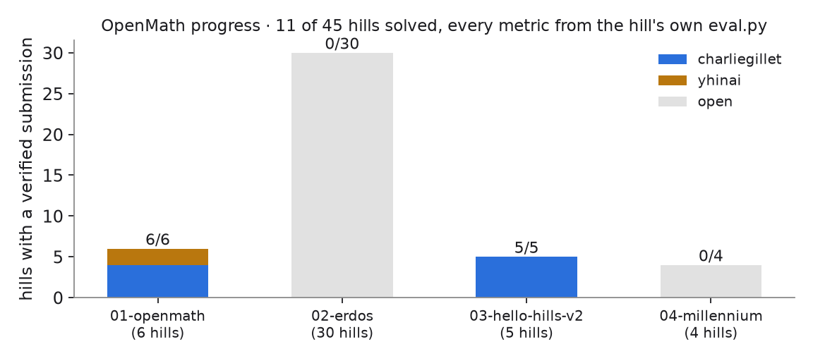
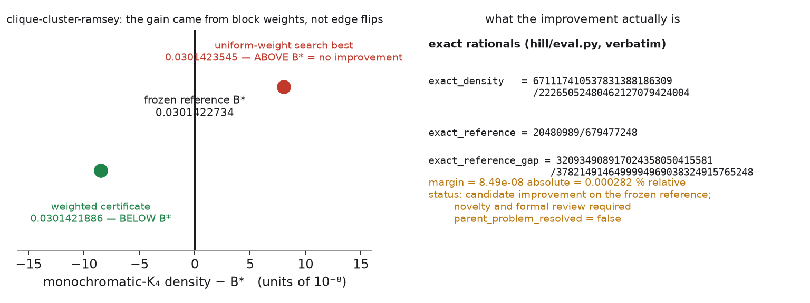
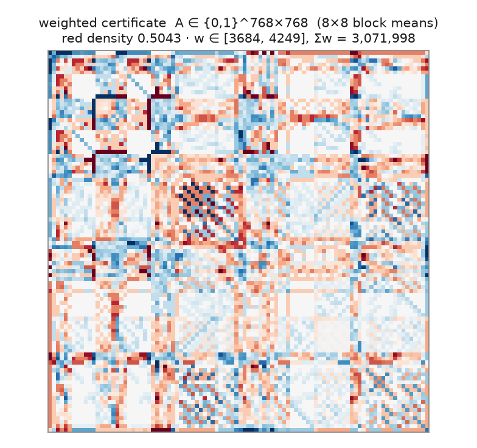
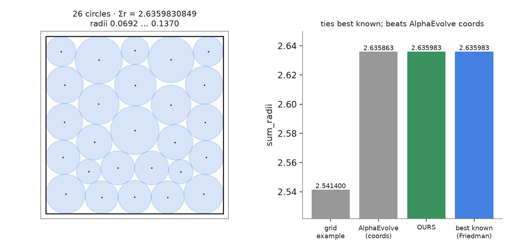
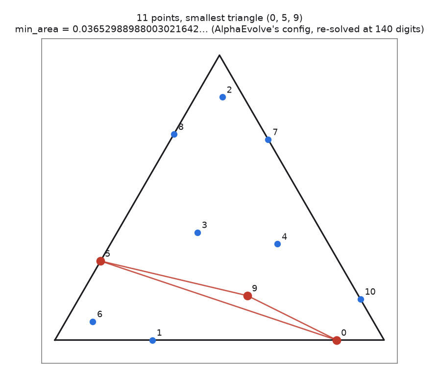

# Figures

Generated from this repository's own submissions — nothing here re-scores anything, and
the metric values come from the hills' `hill/eval.py` as recorded in
[`challenges/RESULTS.md`](challenges/RESULTS.md) and the claim files.

```bash
python3 docs/make_result_figs.py     # regenerates every figure below
```

Attribution: solutions by **charliegillet** except `busy-beaver-6-certificates` and
`kobon-triangles` (yhinai). Figures by yhinai.

---

## 1 · Progress: 11 of 45 hills



`01-openmath` 6/6 · `02-erdos-problems` 0/30 · `03-hello-hills-v2` 5/5 ·
`04-millennium-prize-problems` 0/4. Two of the eleven carry a kernel-checked Lean proof
(`lake build`).

---

## 2 · clique-cluster-ramsey — the one result that beats a frozen reference



In density units, relative to `B* = 20480989/679477248 = 0.030142273431942788`:

| approach | density − B* (×10⁻⁸) | verdict |
| --- | --- | --- |
| uniform-weight edge-flip search (`10486294298/768⁴`) | **+8.03** | above B\* — no improvement |
| weighted certificate, block weights `Σw = 3 071 998` | **−8.49** | below B\* → `reference_beaten = 1` |

Every gram of the gain came from **block weights**, not from edge flips. The margin is
`0.000282 %` relative — the hill's evaluator labels it *"candidate improvement on the
frozen reference; novelty and formal review required"* with
`parent_problem_resolved = false`. It is not a reviewed mathematical result.

The certificate itself (768 blocks, `A = Aᵀ`, red density 0.5043):



---

## 3 · circle-packing — ties the best known



```
grid example (floor)                              2.5414
AlphaEvolve 2025, recomputed from their coords    2.6358627564136983
OURS                                              2.6359830849175787
best known (Packomania / Friedman)                2.635983084919
```

`1.4e-12` below the best known — a practical tie, not a new record. Feasibility is
exact, not floating point: the evaluator parses the numbers as exact rationals.

---

## 4 · heilbronn-triangle — a reproduction, not a discovery



```
baseline     0.0317227922374209557424134398892
alphaevolve  0.0365298898800301230967422996169
OURS         0.0365298898800302164248471279616
```

This is AlphaEvolve's own `n = 11` configuration, re-solved at 140-digit precision; the
`9.33e-17` margin over the bundled example is entirely the removal of rounding error in
its double-precision coordinates. Independent search from scratch never found this
basin (best `0.03358` after ~30 min of 8-way basin hopping).

---

## 5 · What is *not* plotted

`kernel-opt` (timing noisy ~2× on a contended host — quoting the median 66–71 GFLOP/s,
not the 111.30 peak), `shakespeare`, `diffusion-parabola`, `matmul-tensor-3x3`,
`collatz-modular-descent`, `grothendieck-constant-witnesses`, `busy-beaver-6-certificates`,
`kobon-triangles`: numbers without a figure in this document are in
[`challenges/RESULTS.md`](challenges/RESULTS.md).
